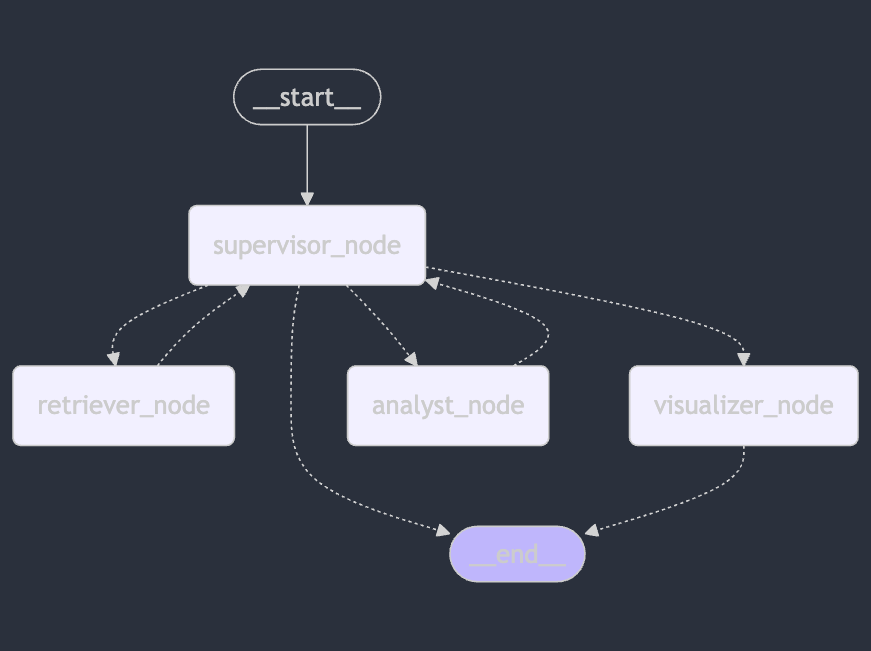

# Building an Insurance Data Analysis Pipeline with LangChain
- Install: `poetry install`

- Start CLI: `python app.py [-h] [--insert-file INSERT_FILE] [--insert-directory INSERT_DIRECTORY] [--query QUERY] [--debug] [--update-summary]` 

- Start UI `python -m streamlit run src/index.py`

-------
**The graph chart:**



User: is it complete?

Assistant: not even close. Works 2 times out of 10.

---------
Embeddings:
Different approaches of document parsing were tried.
Settled down with the current implementation (which is not necessary the best).
Current implementation - extract tabular data in rows and merge each row with the free-text information in the document. For example:

```
Average Expenditures For Auto Insurance 2004-2013

Average expenditure | Percent change
+---------------------+----------------+
| Year                |  Percent Change |
+---------------------+----------------+
| 2004                | 842.65              
| 2005                | 831.58             
+---------------------+----------------+

 Source: &copy; 2016 National Association of Insurance Commissioners (NAIC). 
````

Will be split into data records:
Average Expenditures For Auto Insurance 2004-2013.  Source: &copy; 2016 National Association of Insurance Commissioners (NAIC). Year: 2004, Percent change: 842.65 

Average Expenditures For Auto Insurance 2004-2013.  Source: &copy; 2016 National Association of Insurance Commissioners (NAIC). Year: 2005, Percent change: 831.58 

---------

Possibly a better approach would be to extract the descriptions of the tables from iii.org while crawling the site.

Chat capabilities - https://youtu.be/jAm_Kve7yKs

File Upload - https://youtu.be/jxTPUz7Ikxk
